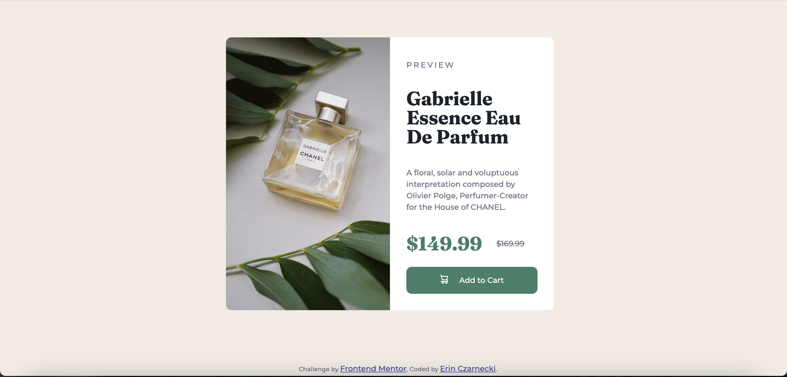

# Frontend Mentor - Product preview card component solution

This is a solution to the [Product preview card component challenge on Frontend Mentor](https://www.frontendmentor.io/challenges/product-preview-card-component-GO7UmttRfa). Frontend Mentor challenges help you improve your coding skills by building realistic projects. 

## Table of contents

- [Frontend Mentor - Product preview card component solution](#frontend-mentor---product-preview-card-component-solution)
  - [Table of contents](#table-of-contents)
  - [Overview](#overview)
    - [The challenge](#the-challenge)
    - [Screenshots](#screenshots)
    - [Links](#links)
  - [My process](#my-process)
    - [Built with](#built-with)
    - [What I learned](#what-i-learned)
    - [Continued development](#continued-development)
  - [Author](#author)

## Overview

### The challenge

Users should be able to:

- View the optimal layout depending on their device's screen size
- See hover and focus states for interactive elements

### Screenshots

### Links

- Solution URL: [GitHub Code](https://github.com/erinczarnecki/FEM_Product-Preview-Card)
- Live Site URL: [Live Site](https://erinczarnecki.github.io/FEM_Product-Preview-Card/)

## My process

### Built with

- Semantic HTML5 markup
- CSS custom properties
- Flexbox

### What I learned

This was a quick exercise with very simple features. The project brief didn't really require any additional knowledge, but I enjoyed working with CSS Flex properties. Declaring color variables in the CSS stylesheet helps ensure that the styling can be updated without having to change multiple lines of code.

### Continued development

Going forward, I was to strengthen my skills with React and may try to repeat this exercise with that.

## Author

- Website - [Erin Czarnecki](https://www.your-site.com)
- Frontend Mentor - [@erinczar](https://www.frontendmentor.io/profile/erinczar)
- GitHub - [@erinczarnecki](https://github.com/erinczarnecki)
- [LinkedIn](https://linkedin.com/in/erin-czarnecki)
